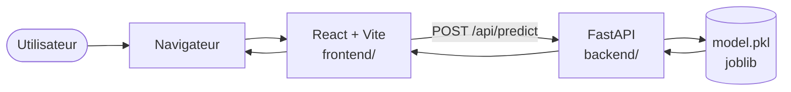
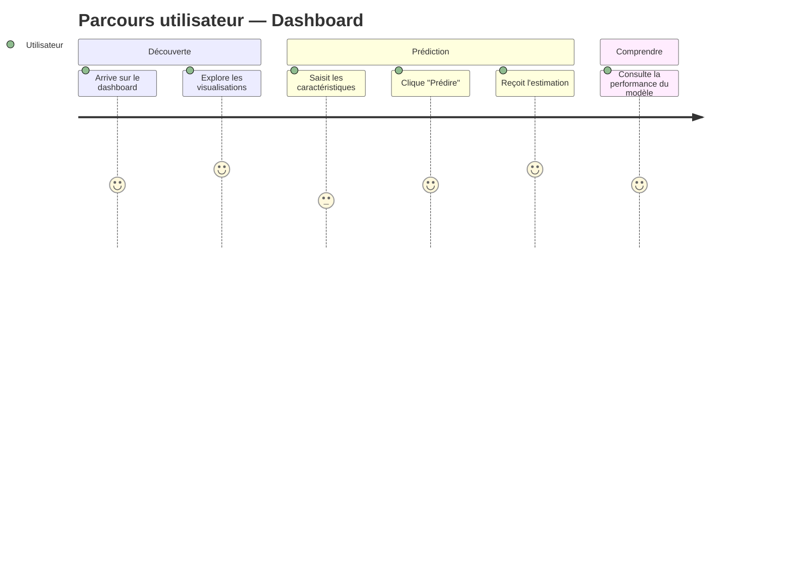
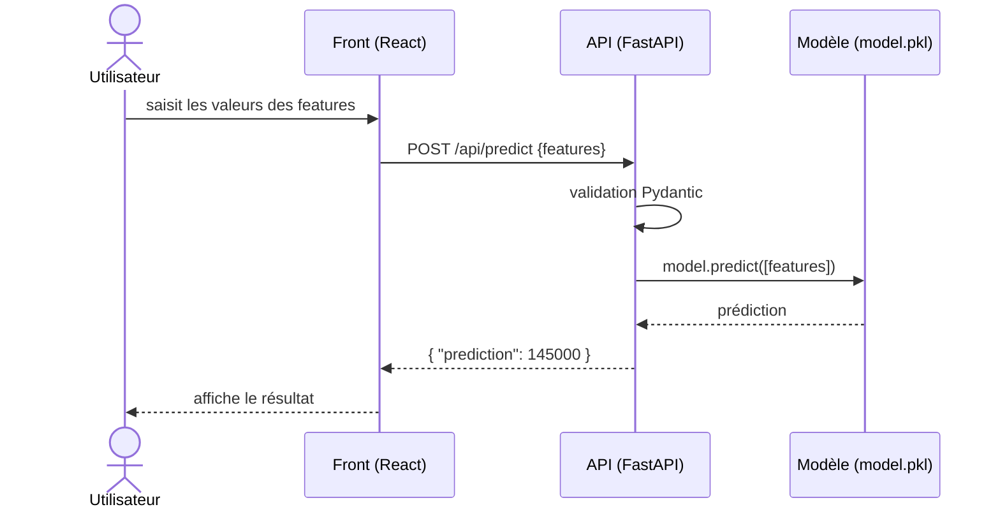

# Phase 1 — Specs, architecture, arborescence & setup

> **But de cette phase** : avant d'écrire la moindre ligne de code utile, **on cadre**. On crée le repo, on configure Claude Code, on documente la stack, le dataset, ce qu'on veut prédire et le parcours utilisateur. *Pas de spec → pas de code* (rappel du principe « specs-first »).

## Livrable attendu en fin de Phase 1

Un **repo Git** (monorepo) qui contient :
- une **arborescence claire** (`frontend/` + `backend/` + `docs/`)
- un **README.md** à la racine
- un **CLAUDE.md** configuré (mémoire projet)
- un dossier **`docs/`** avec **5 fichiers `.md` + 3 schémas mermaid** (cf. §3)
- au moins **3-5 commits** (un repo qui montre votre démarche)

---

## Étape 1 — Créer le repo (monorepo)

```bash
mkdir mon-projet && cd mon-projet
git init
mkdir -p frontend backend docs
touch README.md .gitignore
git add -A && git commit -m "chore: scaffold initial du repo"
```

### Arborescence cible

```
mon-projet/
├── README.md              # présentation + comment lancer
├── CLAUDE.md              # mémoire projet pour Claude Code
├── .gitignore
├── docs/                  # toute la doc (.md + mermaid)
│   ├── architecture.md
│   ├── dataset.md
│   ├── question-predictive.md
│   ├── user-journey.md
│   └── diagramme-sequence.md
├── frontend/              # React + Vite + TS (cf. template fourni)
└── backend/               # FastAPI (cf. template fourni)
```

> **Pourquoi monorepo ?** Une seule session Claude Code voit **la spec ET le code** → contexte complet, moins de drift, prompts plus précis.

---

## Étape 2 — Configurer Claude Code (best practices)

### Le `CLAUDE.md` (la mémoire du projet)

```bash
claude          # lancer Claude Code dans le repo
/init           # génère un premier CLAUDE.md en analysant le repo
```

Compléter le `CLAUDE.md` avec :
- **Stack** : Vite + React + TS + React Query + Tailwind + Recharts / FastAPI + joblib
- **Commandes** : `npm run dev`, `npm run build`, `python main.py`
- **Conventions** : `useState` pour l'état local, **React Query** pour les données serveur, pas de state global
- **À ne pas faire** : pas de réécriture globale d'un fichier qui marche, pas de feature spéculative, changements **chirurgicaux**

### Pour aller plus loin (optionnel — culture pro)

- `.claude/commands/` — slash commands custom (`.md` = une commande), ex : `/commit-push-pr`
- `.claude/skills/` — capacités réutilisables packagées
- `.claude/hooks` — commandes auto sur événement (lint après modif, tests en fin de tâche)

> Pour ce projet, **un bon `CLAUDE.md` suffit largement**. Le reste, c'est pour vos projets en entreprise.

### Réflexes Claude Code (rappel)

1. **Plan mode** (Shift+Tab) avant toute tâche un peu large.
2. **Prompt cadré** : *où* (fichier) + *quoi* exactement + *contraintes* (ce qu'il ne doit PAS faire).
3. **Lire chaque diff** avant d'accepter. « Prouve-moi que ça marche. »
4. **Commits petits et fréquents** (avant chaque grosse demande à l'agent).

---

## Étape 3 — Documenter le projet dans `docs/`

5 fichiers à produire. Chacun = **un peu de texte + un schéma mermaid** (rendu nativement par GitHub).

### 3.1 — `docs/architecture.md`

Le schéma global de l'application (qui parle à qui).

**Texte à écrire** : 1 paragraphe décrivant la stack et les flux ; pourquoi monorepo, pourquoi React+FastAPI, où vit le modèle.

**Schéma type (à adapter)** :



### 3.2 — `docs/dataset.md`

Décrire **précisément** le dataset choisi :
- **Nom**, **source**, **nombre de lignes**, **nombre de colonnes**
- **Tableau des colonnes** : nom · type · signification · exemples
- **Stats clés** : distributions, **valeurs manquantes**, classes déséquilibrées éventuelles
- **Biais ou limites** connus (ex : seulement Paris, seulement 2023…)

### 3.3 — `docs/question-predictive.md`

Énoncer **clairement** ce qu'on veut prédire (c'est l'ancrage de tout le projet).
- La **cible `y`** : nom de la colonne, type (continu / catégoriel)
- Les **features `X`** candidates (3-5)
- **Famille ML** : régression ou classification — **avec justification**
- **Métrique principale** et **pourquoi celle-là** (MAE/RMSE/R² · accuracy/F1/PR-AUC…)
- *Ex : « Je prédis `valeur_fonciere` (continu) à partir de `surface`, `nb_pieces`, `arrondissement`. Régression. Métrique : MAE en euros, plus lisible pour un acheteur. »*

### 3.4 — `docs/user-journey.md`

Comment l'utilisateur **consomme** l'application — en mots + un schéma mermaid `journey`.

**Schéma type (à adapter)** :



> Les chiffres `3:`, `4:`, `5:` = score de satisfaction (1-5) sur chaque étape — utile pour montrer où on accompagne le plus l'utilisateur.

### 3.5 — `docs/diagramme-sequence.md`

Le détail technique de l'**enchaînement front ↔ back ↔ modèle** au moment d'une prédiction.

**Schéma type (à adapter)** :



---

## Étape 4 — `README.md` à la racine

Au minimum :
- **Présentation** du projet (1 paragraphe : quoi, pour qui, quel dataset)
- **Stack** (citer les libs principales)
- **Comment lancer** (commandes front + back)
- Lien vers `docs/` pour la documentation détaillée
- *(Optionnel)* badges, captures d'écran

---

## Comment piloter Claude Code sur cette phase

Cette phase, c'est surtout de la **rédaction** + un peu de **scaffolding**. Bons prompts :

- « Lis `docs/dataset.md` et `docs/question-predictive.md`, puis propose-moi en **plan mode** une arbo `frontend/` (Vite+React+TS) et `backend/` (FastAPI+joblib) cohérente avec ces choix. »
- « Génère un brouillon de `docs/architecture.md` en suivant le schéma mermaid de la fiche Phase 1. Mentionne explicitement notre stack. »
- « Lance `/init` puis complète le `CLAUDE.md` avec : *stack vite+react+ts+rq+tailwind, backend fastapi+joblib, conventions useState/React Query, ne pas réécrire un fichier qui marche*. »

Toujours : **plan d'abord**, **lire le diff**, **commiter**.

---

## ✅ Checklist Phase 1 (à cocher avant Phase 2)

- [ ] Repo Git créé, **premier commit** fait
- [ ] Arbo monorepo : `frontend/` + `backend/` + `docs/`
- [ ] `README.md` initial à la racine
- [ ] `CLAUDE.md` généré (via `/init`) **et complété**
- [ ] `docs/architecture.md` + schéma mermaid `flowchart`
- [ ] `docs/dataset.md` (colonnes, stats, biais)
- [ ] `docs/question-predictive.md` (cible, features, famille, métrique)
- [ ] `docs/user-journey.md` + schéma mermaid `journey`
- [ ] `docs/diagramme-sequence.md` + schéma mermaid `sequenceDiagram`
- [ ] Au moins **3-5 commits** propres (`feat:`, `docs:`, `chore:`…)

> **Si la checklist est verte → vous êtes prêts pour la Phase 2** (code et intégration du modèle).
