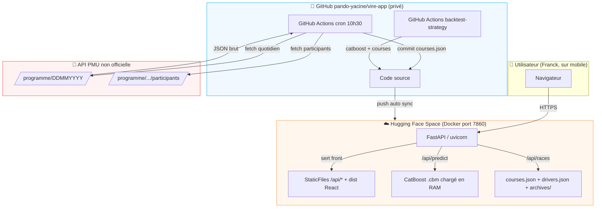
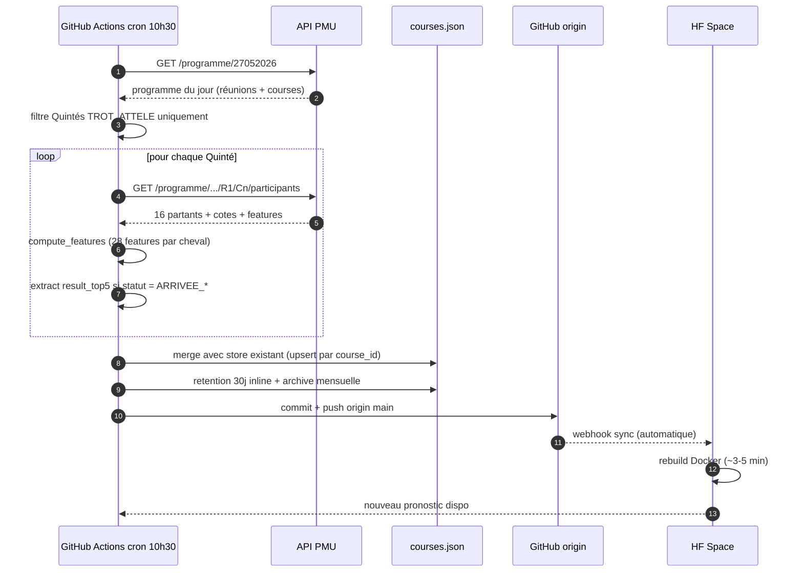
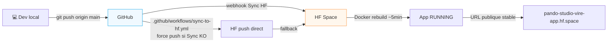

# Vire — projet PMU pro (démo cours J4)

> Étude de cas pour le créneau 9h45-10h30 du J4. Un projet **réel** de Pando Studio qui suit **exactement les mêmes patterns** que votre projet fil rouge, mais à l'échelle pro.

---

## Contexte business (1 min)

**Vire** est un outil de pronostic pour le **Quinté+ trot attelé** (pari hippique mutuel), créé pour **Franck** — un turfiste expert qui veut un outil chiffré pour vérifier ses intuitions.

- **Problème** : Franck a 30 ans d'expérience en trot attelé. Il a des intuitions précises (chronos 2700m sur hippodromes de référence, latéralité du cheval, tracking 500m final). Mais aucun outil existant ne combine **ses critères** avec une **modélisation statistique** sur les données PMU.
- **Solution** : un modèle **CatBoost** entraîné sur ~10 000 courses passées, servi via une app React + FastAPI déployée sur HF Spaces.
- **Disclaimer business** : le takeout PMU sur le Quinté+ est ~30 %. L'app affiche un **edge marker** (notre proba vs proba implicite cote) pour identifier les **value bets**. Sans cette mécanique, suivre passivement le top 5 modèle = perdre −30 % par tour.

---

## Stack technique

| Couche | Technologie |
|---|---|
| **Frontend** | React 18 + Vite + TypeScript + TanStack React Query + Tailwind CSS + Recharts + lucide-react |
| **Backend** | FastAPI + Pydantic + CatBoost (1.2.7) + joblib |
| **Modèle** | CatBoost binary `.cbm` (équivalent `.pkl` pour CatBoost), 28 features, classification binaire « top 5 ou pas » |
| **Pipeline data** | Python (httpx) → API PMU non officielle (`offline.turfinfo.api.pmu.fr`) avec rate limit 1.05 req/s, identified User-Agent |
| **Déploiement** | Hugging Face Spaces (Docker SDK, port 7860) — **EXACTEMENT comme votre projet J3** |
| **CI/CD** | GitHub Actions (cron quotidien 10h30 Paris + sync push HF + backtest stratégie) |
| **Storage** | `git LFS` pour le `.cbm` (550 KB), `git` standard pour les JSON courses |
| **Versioning** | GitHub privé `pando-yacine/vire-app` + remote HF (push 2 cibles) |

---

## Architecture système (mermaid)



**Patterns transférables à votre projet** :
- 1 seul Space Docker qui sert API + front (port 7860)
- Modèle chargé une seule fois au démarrage (`ViredModel` singleton)
- Données pré-calculées en JSON (vs DB) — léger, versionnable, suffisant pour < 100 MB

---

## Pipeline data quotidien (mermaid)



**Pattern transférable** : votre projet ne fait pas de cron quotidien, mais l'idée que **les données = un artifact versionné dans le repo** vous évite une DB. Vos `model.pkl` + un `data.parquet` versionnés = même pattern à petite échelle.

---

## Déploiement (mermaid)



**Le workflow `sync-to-hf.yml` (à copier dans votre projet)** :

```yaml
name: Sync to HF Spaces
on:
  push:
    branches: [main]
jobs:
  sync:
    runs-on: ubuntu-latest
    steps:
      - uses: actions/checkout@v4
        with: { lfs: true, fetch-depth: 0 }
      - name: Push to HF
        run: |
          git push https://USER:${{ secrets.HF_TOKEN }}@huggingface.co/spaces/USER/SPACE main
```

**À adapter** : `USER` et `SPACE` par vos vraies valeurs, et créer `HF_TOKEN` dans GitHub Settings → Secrets → Actions.

---

## 5 patterns que VOUS pouvez reprendre dans votre projet

### 1. Dockerfile multi-stage front + back

```dockerfile
# Stage 1 — build front
FROM node:20-alpine AS frontend-builder
WORKDIR /front
COPY frontend/package*.json ./
RUN npm install
COPY frontend/ ./
RUN npm run build

# Stage 2 — Python + FastAPI serve API + dist/
FROM python:3.11-slim
WORKDIR /app
COPY backend/requirements.txt .
RUN pip install --no-cache-dir -r requirements.txt
COPY backend/ ./
COPY --from=frontend-builder /front/dist /app/frontend_dist
EXPOSE 7860
CMD ["uvicorn", "main:app", "--host", "0.0.0.0", "--port", "7860"]
```

**Pourquoi** : 1 seul container, 1 seul Space, 1 seul URL. Pas de CORS, pas de double déploiement, pas de variables d'env pour reconnecter front et back. Le front est servi par FastAPI à la racine, l'API est sur `/api/...`.

### 2. Modèle chargé une seule fois au démarrage

```python
# backend/main.py
from model_loader import ViredModel
model = ViredModel(MODEL_PATH)   # singleton au démarrage

@app.post("/api/predict")
def predict(course_id: str):
    return model.predict_proba_top5(...)   # réutilise l'instance
```

**Pourquoi** : charger un `.cbm` ou `.pkl` prend ~500 ms. Si tu le fais à chaque requête, tu détruis la latence. Charge **une fois**, partage entre toutes les requêtes.

### 3. Endpoint `/api/health` pour monitoring

```python
@app.get("/api/health")
def health():
    return {"status": "ok", "model_loaded": True, "n_courses": len(COURSES)}
```

**Pourquoi** : un service externe (UptimeRobot, healthchecks.io) ping cet endpoint toutes les 5 min. Si ça retourne autre chose que 200 → alerte mail. **Indispensable** en prod.

### 4. Pydantic pour valider les entrées API

```python
from pydantic import BaseModel

class SimulateRequest(BaseModel):
    course_id: str
    num_pmu: int
    feature_overrides: dict[str, float]

@app.post("/api/simulate")
def simulate(req: SimulateRequest):   # validation auto avant d'entrer dans la fonction
    ...
```

**Pourquoi** : si quelqu'un t'envoie `num_pmu: "abc"`, Pydantic répond `422 Unprocessable Entity` automatiquement, sans que ton code Python plante. Documentation auto-générée sur `/docs`. **C'est exactement la même chose que les types TypeScript**, côté serveur.

### 5. Feature flag pour fonctionnalités expérimentales

```python
# backend/strategy.py
def is_visible():
    return os.environ.get("STRATEGY_VISIBLE", "0") == "1"

@app.get("/api/strategy/{course_id}")
def strategy(course_id):
    if not is_visible():
        raise HTTPException(404)
    ...
```

**Pourquoi** : une feature en cours de calibration ne doit pas être exposée au grand public. Le feature flag (env var) permet d'activer/désactiver sans redéployer. Coût d'implémentation : 3 lignes. Coût de réparation si tu pousses une mauvaise feature en prod : énorme.

---

## Liens

- **Repo GitHub** : `pando-yacine/vire-app` (privé)
- **HF Space** : https://pando-studio-vire-app.hf.space
- **Doc roadmap** : `docs/prochaines-phases.md` dans le repo
- **Doc calibration** : `docs/calibration-guide.md` dans le repo

---

## Ce que ce projet vous montre

Votre projet B3 est un **prototype**. Vire est un **produit pro** mais **construit avec les mêmes briques** :

- Même stack (React + FastAPI + HF Spaces)
- Même pattern Dockerfile multi-stage
- Même approche `git push` = déploiement
- Même usage Pydantic pour valider
- Même séparation API / front à l'intérieur d'un seul Space

La différence n'est PAS la stack. C'est :
- **Le soin du polish UX** (HeroCard, drawer, tooltips, onboarding, refresh button, badge statut, edge marker)
- **L'industrialisation** (CI/CD, monitoring, backtest CI, feature flags, calibration guide)
- **Le narratif business** (un user clair = Franck, un problème clair = pari mutuel, une asymétrie économique claire = takeout 30 %)

→ Pour votre soutenance cet après-midi, **inspirez-vous de ce niveau de soin**. Pas besoin d'avoir autant de features. Mais **soigner les 2-3 features que vous avez** = la différence entre 14/20 et 17/20.
